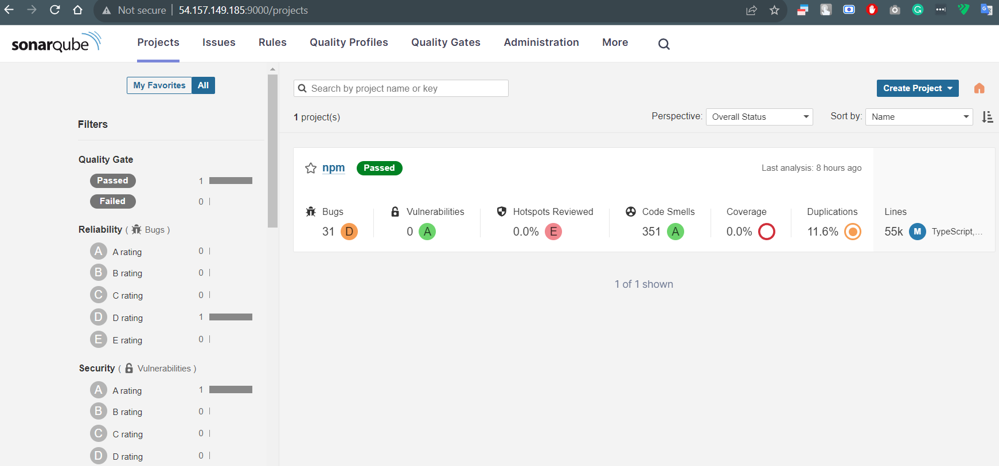
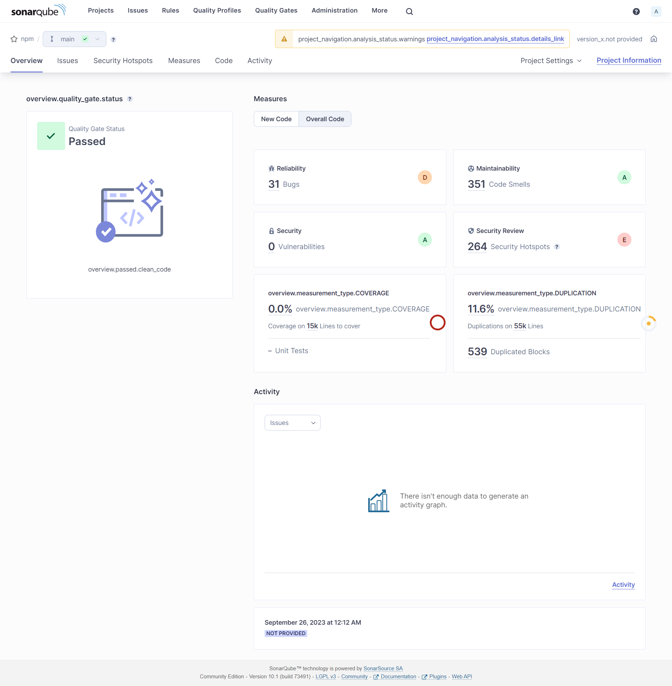
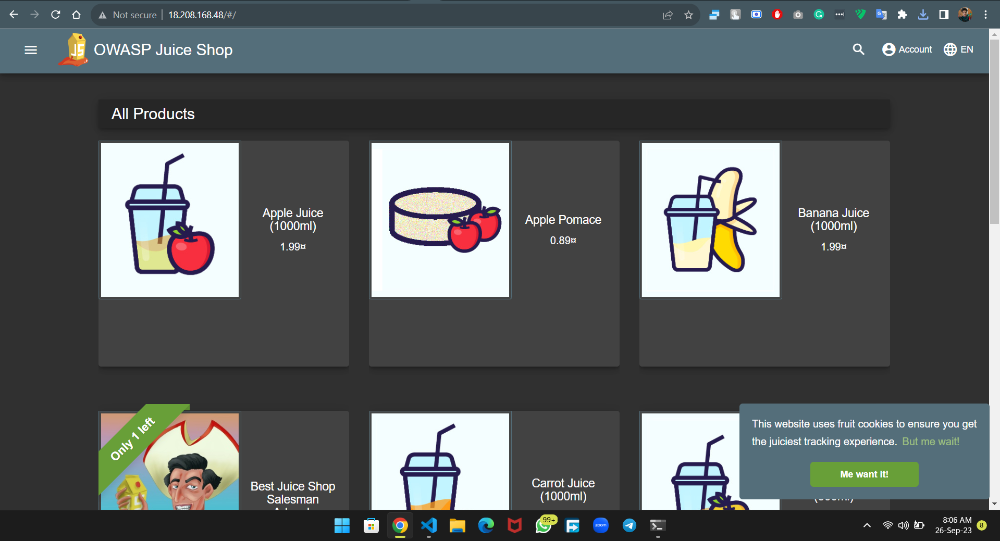
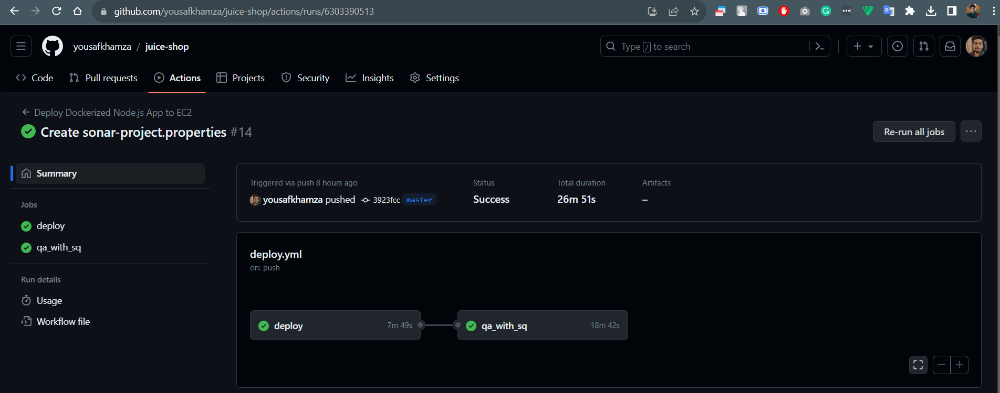

# Juice shop Deployment with Static Application Security Test by Yousaf
----

### Description
----
Juice Shop is written in Node.js, Express and Angular. It was the first application written entirely in JavaScript listed in the OWASP VWA Directory.

The application contains a vast number of hacking challenges of varying difficulty where the user is supposed to exploit the underlying vulnerabilities. The hacking progress is tracked on a score board. Finding this score board is actually one of the (easy) challenges!

Apart from the hacker and awareness training use case, pentesting proxies or security scanners can use Juice Shop as a “guinea pig”-application to check how well their tools cope with JavaScript-heavy application frontends and REST APIs.

Translating “dump” or “useless outfit” into German yields “Saftladen” which can be reverse-translated word by word into “juice shop”. Hence the project name. That the initials “JS” match with those of “JavaScript” was purely coincidental!

### Pre-Requests
----
#### Two ec2 instances: 
    - INSTANCE 1: juice shop instance (please make sure to configure the same via userdata or manually github ssh configured, docker installed, if required please install mvn)
    - INSTANCE 2: sonarqube instance (please use amazon market place ami's or configure it manually)
#### Configure env variables under repo actions secrets. 
    - DOCKER_PASSWORD (your registry username)
    - DOCKER_USERNAME (your registry password)
    - SONAR_HOST_URL (host url of your instance two with sonarqube port)
    - SONAR_TOKEN (create a user token under my account --> security)
    - SSH_HOST (juice shop instnace ip)
    - SSH_USER (juice shop instance user)
    - SSH_PRIVATE_KEY (juice shop instance pem file)

### Configure workflow pipleine look like below
----
```
name: Deploy Dockerized Node.js App to EC2

on:
  push:
    branches:
      - master

jobs:
  deploy:
    runs-on: ubuntu-latest

    steps:
    - name: Checkout code
      uses: actions/checkout@v2

    - name: Install Docker
      run: |
        sudo apt-get update
        sudo apt-get -y remove docker docker-engine docker.io containerd runc
        sudo apt-get -y install apt-transport-https ca-certificates curl software-properties-common
        curl -fsSL https://download.docker.com/linux/ubuntu/gpg | sudo gpg --dearmor -o /usr/share/keyrings/docker-archive-keyring.gpg
        echo "deb [arch=amd64 signed-by=/usr/share/keyrings/docker-archive-keyring.gpg] https://download.docker.com/linux/ubuntu $(lsb_release -cs) stable" | sudo tee /etc/apt/sources.list.d/docker.list > /dev/null
        sudo apt-get update
        sudo apt-get -y install docker-ce docker-ce-cli containerd.io
        sudo systemctl start docker
        sudo systemctl enable docker
    - name: Build Docker Image
      run: |
        docker build -t yousafkhamza/juice-shop-kpmg:latest .
    - name: Push Docker Image to Docker Hub
      run: |
        echo ${{ secrets.DOCKER_PASSWORD }} | docker login -u ${{ secrets.DOCKER_USERNAME }} --password-stdin
        docker push yousafkhamza/juice-shop-kpmg:latest
        
    - name: SSH into EC2 and Deploy
      uses: appleboy/ssh-action@master
      with:
        host: ${{ secrets.SSH_HOST }}
        username: ${{ secrets.SSH_USER }}
        key: ${{ secrets.SSH_PRIVATE_KEY }}
        script: |
          # Pull the latest Docker image from your Docker registry (e.g., Docker Hub)
          sudo docker pull yousafkhamza/juice-shop-kpmg:latest
          # Stop and remove the existing container (if running)
          sudo docker stop juice_shop_kpmg || true
          sudo docker rm juice_shop_kpmg || true
          # Run a new Docker container with the updated image
          sudo docker run -d --name juice_shop_kpmg -p 80:3000 yousafkhamza/juice-shop-kpmg:latest 
          
  qa_with_sq:
    runs-on: ubuntu-latest
    needs: deploy
    steps:
      - name: Checkout source code
        uses: actions/checkout@v2
        with:
          fetch-depth: 0
      - name: Setup Node.js
        uses: actions/setup-node@v1
        with:
          node-version: 18
      - name: Install dependencies
        run: npm install
     
      - name: SonarQube Scan
        uses: sonarsource/sonarqube-scan-action@master
        env:
          SONAR_TOKEN: ${{ secrets.SONAR_TOKEN }}
          SONAR_HOST_URL: ${{ secrets.SONAR_HOST_URL }}
```

## OUTPUT SNAPSHOTS
----
#### SONAR QUBE:



#### JUICE SHOP:


### WORKFLOW OUTPUT: 


## CONCLUSION
----
After juice shop deployment the pipeline will scan the source with the help of sonarqube that help us to find out the bugs and vulnarabilities on our source code. 